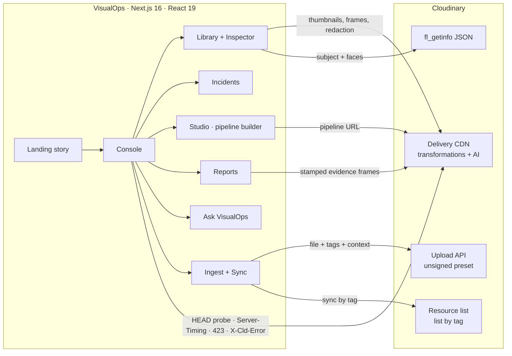

# VisualOps

**Turn visual data into operational intelligence.**

Hackathon team repository for Team rocket - [hackindia-team:pixels-to-products-cloudinary-ai-hackathon-2026:team-rocket]

VisualOps turns field photos, drone footage and CCTV into searchable, structured, actionable records. Every frame is delivered, understood and transformed by **Cloudinary**; VisualOps adds the operational layer on top — records, search, incident intelligence and evidence reports.

```
RAW MEDIA → CLOUDINARY → AI UNDERSTANDING → TRANSFORMATION → ORGANIZATION → SEARCH → INTELLIGENCE → ACTION
```

---

## Hackathon

**Pixels to Products — Cloudinary AI Hackathon 2026**
**Track 1 — AI Media Pipelines**

## Problem

Maintenance, construction, inspections, facilities, fleet and field teams produce huge amounts of visual media: phone photos sent to chat groups, drone passes, CCTV exports, intake photos. It arrives with a file name and nothing else — no site, no severity, no owner. It is scattered, hard to search, impossible to report on, and full of people who should not be identifiable when it is shared. The evidence exists; the intelligence does not.

## Solution

VisualOps is a web console that runs every capture through a Cloudinary media pipeline and turns it into an operational record:

| Stage | What happens | How |
| --- | --- | --- |
| **Raw media** | Photos and video are stored and delivered from Cloudinary; stills are extracted from footage | Upload API (unsigned preset), `so_` frame extraction |
| **Understand** | Cloudinary picks a content-aware crop and detects faces in each frame; detected faces can be pixelated; soft captures are corrected | `g_auto`, `fl_getinfo`, `e_pixelate_faces`, `e_improve`, `e_sharpen` |
| **Structure** | Each asset becomes a record: site, zone, category, severity, status, observation, action | Cloudinary tags + contextual metadata, resource-list sync |
| **Search** | Plain-language questions become explicit, visible filters | Transparent query parser over the structured index |
| **Insight** | Risk by site, category × severity, capture activity | Aggregates computed from the records |
| **Action** | Evidence packages with stamped, redacted frames and a verifiable fingerprint | `l_text` audit stamp, `e_pixelate_faces`, SHA-256 of the export |

A guiding principle: **generative AI never touches the record.** Every pipeline step carries an integrity class — *Evidence-safe*, *AI edit* or *Generative* — shown on the step, the output and the export. Reports only ever use evidence-safe renditions.

## Cloudinary Integration

Everything below is live Cloudinary functionality — nothing is simulated. You can open any URL the app shows and it renders the same for anyone.

**Delivery and optimisation**
- Delivery URLs for every image and video, responsive renditions, `c_fill` / `c_limit` / `c_pad`, `q_auto`, `f_auto` (AVIF/WebP/JPEG per browser), `vc_auto` for video.
- **Measured, not claimed:** sizes, formats, cache status and processing time are read from Cloudinary's `Server-Timing` header (`content-info` exposes original vs delivered bytes). Errors come from `X-Cld-Error`.

**AI understanding**
- `g_auto` content-aware cropping, and `fl_getinfo` to read back, as JSON, the square crop window `g_auto` chose and any facial landmarks Cloudinary detected (shown as live overlays, labelled "g_auto 1:1 crop" and "face detections").
- `e_pixelate_faces` / `e_blur_faces` privacy redaction. Redaction is only as good as the detection: VisualOps reads the live face count and says so when Cloudinary found no faces ("nothing pixelated — review manually") instead of claiming a frame is redacted.

**Generative AI and AI edits (Visual AI Pipeline Builder + Generative Studio)**
- `e_background_removal`, `e_gen_background_replace` (prompt), `b_gen_fill` (generative fill / canvas extension), `e_gen_replace` (object replacement), `e_gen_recolor`, `e_gen_remove`, `e_gen_restore`, `e_upscale`, `e_enhance`, `e_improve`, `e_sharpen`.

**Video**
- Transcoding and resizing, trimming (`so_` / `du_`), frame extraction to JPEG, **AI highlights** (`e_preview:duration_N`) and **AI subject-tracking reframe** (`c_fill,ar_9:16,g_auto`). Cloudinary renders the last two asynchronously and answers HTTP 423 until they are ready — VisualOps polls and shows the real status.

**Annotation and export**
- `l_text` audit stamps (finding ID, severity, date) burned into report frames; for the sample dataset, whose capture times are synthetic, the stamp reads `SAMPLE` instead of a date. `fl_attachment` downloads.

**Ingestion and sync (your own cloud)**
- Browser uploads through the Upload API with an **unsigned upload preset**, carrying `tags` and `context` metadata (site, category, severity, observation).
- **Sync from Cloudinary** reads everything carrying the VisualOps tag through the client-side resource list (`/<type>/list/<tag>.json`), including that context metadata.
- No API key or secret is used anywhere in the app.

**SDKs**
- `next-cloudinary` and the `cloudinary` Node SDK: the Studio exports each pipeline as next-cloudinary (React), the exact URL, the Node.js SDK, the Python SDK, cURL and pipeline JSON. `npm run verify:cloudinary` proves the React and Node exports reproduce the same transformations.

## Architecture



- **One source of truth for transformations.** Each pipeline step (`src/lib/cloudinary/pipeline.ts`) builds one Cloudinary transformation component. The Studio renders that URL, and the code exporter generates SDK code that `scripts/verify-cloudinary.mjs` runs through the real SDKs to confirm the output matches.
- **Live status, honestly shown.** Before displaying a render, VisualOps sends a `HEAD` request: `200` shows it with measured bytes and format, `423` means Cloudinary is still processing async AI and triggers polling, and anything else shows Cloudinary's own error message.
- **Client-only console.** The console reads the viewer's clock, URL hash (deep links such as `/console#studio/vo-road-collapse`) and `localStorage` (uploads and settings in this browser). The landing page is statically rendered.

## Features

- **Landing page** — an art-directed product story:
  - a hero with a kinetic VISUALOPS wordmark, a raw-vs-Cloudinary inspection frame you scrub with the pointer, and live delivery telemetry;
  - a WebGL field of image fragments sampled from one texture atlas that Cloudinary composites from the field captures;
  - a pinned scroll scene in which the media wall visibly moves through RAW MEDIA → UNDERSTAND → STRUCTURE → SEARCH → INSIGHT → ACTION (kinetic typography, a real query, a real SHA-256);
  - editorial Solutions and Evidence sections;
  - a product preview that scales to full screen and morphs into the console through a view transition;
  - a Cloudinary telemetry section and a capability explorer, measured live.
- **Command Center (Overview)** — the worst open finding first, then:
  - animated key numbers;
  - capture timeline and inspection progress by site;
  - delivery latency and CDN hit ratio from live probes;
  - a live stream of the real Cloudinary responses from this session (deliveries, 423 renders, `fl_getinfo`).
- **Smart Media Library** — an editorial mosaic; search and filter by type, category, severity, site and source; grid and list layouts; hover reveals with Cloudinary-trimmed video clips and lazily fetched AI signals; the tile morphs into the Inspector (Back closes it; `#library/<id>` deep links open it).
- **Inspector** — original, evidence (`e_improve` + `e_sharpen`) and face-redacted renditions. Overlays keep the sample annotation, Cloudinary's live `g_auto` crop and face detections separate. Also: video playback with Cloudinary-extracted keyframes, measured delivery, copy URL, open original, download.
- **Visual Incident Intelligence** — a lead panel for the most severe open finding, then findings grouped by severity. Filters: severity, category, location, date window, media type and status. An animated, clickable category × severity matrix.
- **Studio — Visual AI Pipeline Builder** — drag-to-reorder steps, toggle, configure, delete, and preview up to any step. It has 20 step types across framing, correction, privacy, annotation, AI edits, generative AI, video and delivery, and 11 presets: evidence enhance, privacy redaction, audit stamp, low-res recovery, asset-register cutout, remediation preview, field clip, vertical brief, AI highlights, product studio and colourway.
- **Pipeline machine** — *Run pipeline* executes UPLOAD → ANALYZE → TAG → TRANSFORM → OPTIMIZE → INDEX against Cloudinary for the selected capture:
  - a `HEAD` of the stored original;
  - `fl_getinfo`;
  - tags from the record plus Cloudinary signals;
  - a probe of the pipeline URL (async 423 renders are polled);
  - measured optimisation;
  - indexing.

  Each node shows its real latency and result, and warns when an output is larger than its source or generative.
- **Before / After viewer** — slider (with the original given the same framing so pixels line up), side by side and output-only; zoom from 1× to 4× with panning (buttons, keys, Ctrl/⌘ + wheel, double-click); fullscreen; keyboard-accessible handle. Video is compared side by side with "play both".
- **Generative Studio** — prompt-based background replacement with presets, plus object replace, recolour, remove and canvas fill. Outputs are always marked *Generative*.
- **Code / URL generator** — React (next-cloudinary), URL, Node.js SDK, Python SDK, cURL and pipeline JSON; copy and download.
- **Ask VisualOps (Ctrl/⌘ K or /)** — plain-language questions such as *"Show high severity issues from Building B"*:
  - Each search runs in visible stages, index → metadata → filters → results, with the real counts at each stage.
  - The interpretation is shown as chips, and matching evidence lifts out of a visual index.
  - Keywords with no match are reported, not silently dropped, and related-term matches are disclosed.
  - A zero-result query suggests which filter to relax.
  - *Report on these* turns a result set into a report.
- **Reports** — Inspection report, Incident summary, Media analysis report (measured delivery and AI signals) and Asset summary; scope by site, severity, status and date.
  - Generation runs in real stages: collect media → analyse findings → attach evidence (every frame probed on Cloudinary) → build the audit package → report ready.
  - Evidence frames are Cloudinary-stamped, and redaction wording follows the live face-detection result.
  - Export to Print/PDF, Markdown, JSON or CSV with a SHA-256 fingerprint computed in the browser. Exports carry each finding's provenance.
- **Ingest and sync** — drag-and-drop uploads to your cloud with progress, and tag-based sync back from Cloudinary. On the demo cloud, Sync imports real tagged images.
- **Accessible, smooth motion** — every animation respects `prefers-reduced-motion` with a complete static layout. Scroll scenes drive transforms directly and never re-render React per frame. rAF loops and WebGL run only while visible, and devices are tiered. Dialogs trap focus and close on Escape; controls are keyboard-operable; text meets WCAG AA contrast.

## Setup

Requirements: **Node.js 20.9 or newer** (Next.js 16).

```bash
git clone https://github.com/iabhishekn/pixels-to-products-cloudinary-ai-hackathon-2026-team-rocket.git
cd pixels-to-products-cloudinary-ai-hackathon-2026-team-rocket
npm install
npm run dev
```

Open http://localhost:3000 for the story and http://localhost:3000/console for the app. No configuration is needed: the sample dataset renders from Cloudinary's public `demo` cloud.

Production build:

```bash
npm run build
npm run start
```

Checks:

```bash
npm run lint                 # ESLint
npm run typecheck            # TypeScript
npm run verify:cloudinary    # live Cloudinary checks (dataset, presets, code-export parity)
```

## Environment Variables

Copy `.env.example` to `.env.local` (never commit `.env.local`). All values are **public**; VisualOps never needs an API key or secret.

| Variable | Required | Purpose |
| --- | --- | --- |
| `NEXT_PUBLIC_CLOUDINARY_CLOUD_NAME` | For uploads/sync | Your Cloudinary cloud name. Defaults to `demo`. |
| `NEXT_PUBLIC_CLOUDINARY_UPLOAD_PRESET` | For uploads | An **unsigned** upload preset (Console → Settings → Upload → Upload presets). |
| `NEXT_PUBLIC_VISUALOPS_TAG` | No | Tag added to uploads and read by Sync. Defaults to `visualops`. |

The same values can be set at runtime in the console (cloud pill → *Cloudinary*); they are stored in that browser only. For **Sync**, your cloud must allow resource lists (Console → Settings → Security → uncheck *Resource list* under restricted media types).

## Demo

A recommended three-minute path:

1. **Landing** — move the pointer across the hero frame (raw drone frame vs Cloudinary evidence rendition) and read the live telemetry beneath it. Scroll the six-stage story, then continue until the product preview fills the screen and choose *Launch console*: the preview morphs into the app. In Technology, pick transformations in the capability explorer.
2. **Console → Overview** — the lead incident, the key numbers, inspection progress by site, live delivery latency and the stream of real Cloudinary responses.
3. **Ask VisualOps (Ctrl/⌘ K)** — try *"Show high severity issues from Building B"*, then *"Show all damaged equipment"*: it discloses which related terms matched and which filter kept the rest out.
4. **Library → IMG_4821.JPG** — toggle Evidence view, Faces redacted, the `g_auto` crop and face detections. Open **DJI_0412.MOV** and click the keyframes. Press Back to close the Inspector.
5. **Studio** — on `IMG_2208.JPG` press *Run pipeline* and watch the six stages report real latencies. Then load *Privacy redaction* and drag the slider. On `WhatsApp Image 0412.jpeg`, load *Remediation preview* and see the output marked *Generative*. On `DJI_0412.MOV`, load *AI highlights*: Cloudinary may answer 423 first, so watch it resolve. Open **Export code**.
6. **Incidents** — click a matrix cell, then *Report on these*.
7. **Reports** — press *Generate report* and watch the staged compilation. Switch templates, toggle face redaction, download Markdown/JSON and print to PDF; note the SHA-256.
8. **Ingest** — on the demo cloud, *Sync* imports real tagged images from Cloudinary. With your own cloud and unsigned preset, drop in a field photo and see it appear in the library.

## Project Structure

```
src/
  app/
    page.tsx                  Landing page (server-rendered shell)
    console/page.tsx          Console route
    privacy/, terms/          Legal pages
    layout.tsx, globals.css   Fonts, metadata, design tokens (dark + .theme-light), print & reduced-motion styles
  components/
    site/                     Company navigation, footer (live Cloudinary status), contextual cursor
    motion/                   Device tiering, visibility-gated rAF, animated numbers, masked text reveals
    landing/                  Hero (+ hero/, gl/ WebGL field), Statement, story/ (pinned six-stage scene),
                              editorial/ (Solutions, Evidence), product/ (console preview + morph), tech/, FinalCta
    console/                  Shell, store (state + hash routing), views/, overview/, library/, incidents/,
                              studio/ (+ machine/), ask/, reports/, inspector, ingest, settings
    media/                    Probed renders, before/after viewer, video compare, frame strip, overlays, delivery receipt
    ui/                       Badges, segmented control, dialog/sheet, copy button, platform modifier key
  lib/
    cloudinary/               url.ts (URL builder) · media.ts (renditions) · pipeline.ts (steps & presets)
                              codegen.ts (SDK export) · probe.ts (Server-Timing/423 probes) · insights.ts (fl_getinfo)
                              upload.ts (unsigned upload & sync) · atlas.ts (Cloudinary-composited texture atlas) · config.ts
    data/dataset.ts           Sample dataset (15 field assets + 2 generic samples on Cloudinary's demo cloud)
    search/query.ts           Ask VisualOps parser and matcher
    analytics.ts, report.ts   Aggregates, report models, exports, SHA-256
scripts/verify-cloudinary.mjs Live verification against Cloudinary
```

## Data and honesty notes

- **Sample media** is real media hosted on Cloudinary's public `demo` cloud (object-detection docs imagery and demo videos), so every transformation is genuine and needs no account.
- **Sample findings** (site, category, severity, observation, action) are annotations written by the team for this dataset and describe only what is visible. The UI and the exports label them *Sample annotation*.
- **Cloudinary's AI signals are live and kept separate from the annotations.** These are the `g_auto` crop window and face detections from `fl_getinfo`. Face detections are automatic and can miss people or flag objects, so the UI asks you to check them before sharing.
- Sample capture times are relative to your clock, so "today" and "this week" stay meaningful. They are labelled as sample times, and audit stamps show `SAMPLE` instead of a date. The CCTV clip keeps its burned-in timestamp.
- **Open** means a finding with status *open*. *Unresolved* also includes findings under monitoring. The landing preview, the Command Center, Incidents and Reports use the same definitions.
- Delivery savings are measured from Cloudinary's `Server-Timing` header. They include resizing to display size as well as `q_auto`/`f_auto`, and are labelled that way.
- **Uploads and sync** use documented public Cloudinary endpoints. Sync was verified against the demo cloud (tag `truck`). Uploading requires your own unsigned preset and was not exercised against a real account while building this submission.
- Ask VisualOps is a transparent parser, not a language model. It shows its interpretation.

## Verification

`npm run verify:cloudinary` (no credentials needed) checks against the live Cloudinary CDN that:
- every sample asset's thumbnail, display rendition, original, playback stream and `fl_getinfo` response resolves;
- the Node SDK, given the exact transformation objects the Studio exports, and next-cloudinary's URL loader, given the exact React props, produce the same transformations as the rendered URL (all 20 step types and 11 presets);
- every preset renders, and report evidence frames render with stamp and redaction.

## Team

**Team Rocket** — HackIndia · Pixels to Products, Cloudinary AI Hackathon 2026.

| Member | Role |
| --- | --- |
| Abhishek Nayak | Repository owner |

## License

MIT — see [LICENSE](LICENSE).
