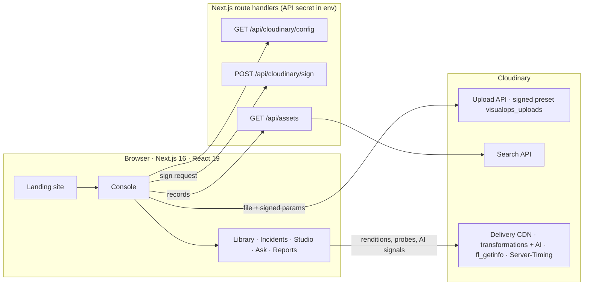

# VISUALOPS — AI-POWERED VISUAL INTELLIGENCE

**Turn visual data into operational intelligence.**

Hackathon team repository for Team rocket - [hackindia-team:pixels-to-products-cloudinary-ai-hackathon-2026:team-rocket]

VisualOps turns the photos, drone footage and CCTV clips that field teams already capture into searchable, structured, decision-ready evidence. Cloudinary stores, understands, transforms and delivers every frame; VisualOps adds the operational layer on top: records, incident intelligence, search and evidence reports.

```
RAW MEDIA → CLOUDINARY → AI UNDERSTANDING → TRANSFORMATION → STRUCTURED RECORD → SEARCH → INSIGHT → ACTION
```

## Hackathon

**Pixels to Products — Cloudinary AI Hackathon 2026** (HackIndia) · **Track 1: AI Media Pipelines**

## Problem

Maintenance, construction, inspection, facilities and fleet teams produce huge amounts of visual media: phone photos sent to chat groups, drone passes, CCTV exports, intake photos. It arrives with a file name and nothing else — no site, no severity, no owner. It is scattered, hard to search, impossible to report on, and full of people who should not be identifiable when it is shared.

## Solution

VisualOps runs every capture through a Cloudinary media pipeline and turns it into an operational record:

| Stage | What happens | Cloudinary |
| --- | --- | --- |
| **Capture** | Photos and video are uploaded to the team's cloud with the record fields attached | Upload API with a **server-signed** upload preset; `tags` + contextual metadata |
| **Understand** | Cloudinary picks a content-aware crop and detects faces; soft captures are corrected | `g_auto`, `fl_getinfo`, `e_improve`, `e_sharpen`, `e_pixelate_faces` |
| **Structure** | Each asset is a record: site, category, severity, observation, finding id | Tags + context stored on the asset, read back with the **Search API** |
| **Search** | Plain-language questions become explicit, visible filters | Transparent query parser over the records |
| **Insight** | Worst-first incidents, category × severity matrix, progress by site | Aggregates over the records |
| **Action** | Evidence reports with stamped, face-redacted frames and a SHA-256 fingerprint | `l_text` audit stamp, `e_pixelate_faces`, `q_auto`/`f_auto` |

A guiding principle: **generative AI never touches the record.** Every pipeline step carries an integrity class — *Evidence-safe*, *AI edit* or *Generative* — shown on the step, the output and the export. Reports only use evidence-safe renditions.

## Key features

- **Landing site** — the product story. It has:
  - a raw-vs-Cloudinary inspection frame with live delivery telemetry;
  - a WebGL field built from a texture atlas that Cloudinary composites in one request;
  - a six-stage scroll story, and a product preview that morphs into the console;
  - a live Cloudinary capability explorer (crop, redaction, upscale, background removal, generative replace, video highlights, `f_auto`/`q_auto`).
- **Command Center** — the worst open finding first, then:
  - key numbers and capture activity;
  - inspection progress by site;
  - delivery latency and CDN hit ratio measured from Cloudinary's `Server-Timing` headers;
  - a live stream of the Cloudinary responses from the session.
- **Media Library + Inspector** — an editorial mosaic with filters, hover reveals and Cloudinary-trimmed video previews. The Inspector offers original, evidence-enhanced and face-redacted renditions, a `g_auto` crop overlay, face detections, video keyframes, a delivery receipt, copy URL and download.
- **Incident Intelligence** — a lead finding, findings grouped by severity, and a clickable category × severity risk matrix. Filters: status, severity, category, site, date and media type.
- **Studio — Visual AI Pipeline Builder** — 20 transformation step types and 11 presets. It includes a before/after viewer (slider, side-by-side, zoom) and a generative panel (background replace, object replace, recolour, remove, fill). Code export covers React (next-cloudinary), URL, Node, Python, cURL and JSON.
- **Pipeline machine** — runs *Upload → Analyze → Tag → Transform → Optimize → Index* against Cloudinary for one capture, showing each stage's real latency and result:
  - verifies the stored original;
  - reads `fl_getinfo`;
  - probes the transformation, including async 423 renders;
  - measures the optimisation.
- **Ask VisualOps** (Ctrl/⌘ K or `/`) — plain-language questions such as *"Show high severity issues from Building B"*:
  - Each search runs in visible stages, with its interpretation shown as chips.
  - Unmatched words are reported rather than dropped, and related-term matches are disclosed.
  - A zero-result query suggests which filter to relax.
- **Reports** — four templates: inspection, incident summary, media analysis and asset summary.
  - Generation runs in real stages; every evidence frame is probed on Cloudinary.
  - Evidence frames are stamped, and redaction wording follows the live face detections.
  - Export to Print/PDF, Markdown, JSON or CSV with a SHA-256 fingerprint computed in the browser.
- **Ingest** — signed uploads to the team's Cloudinary cloud with site, category, severity and observation. The records are read back from Cloudinary on every device.
- **Accessible, smooth motion** — every animation respects `prefers-reduced-motion`. Scroll scenes write transforms directly, and WebGL and animation loops run only while visible. Dialogs trap focus, and controls are keyboard-operable.

## How VisualOps works

1. **Ingest.** In the console, *Ingest* asks the VisualOps server to sign an upload (`POST /api/cloudinary/sign`).
   - The server validates the record fields.
   - It pins the VisualOps tag and the signed preset `visualops_uploads`.
   - It signs the exact parameters with the API secret.
   - The browser then uploads the file **directly to Cloudinary**; file bytes never pass through the server.
2. **Store.** Cloudinary keeps the media plus the record, as tags (`visualops`, category, site) and contextual metadata (title, site, category, severity, observation, finding id, source).
3. **Read back.** When the console opens, the server queries Cloudinary's **Search API** (`GET /api/assets`, `tags=visualops`) and returns every record with its metadata. The library, incidents, search and reports work from these records plus the bundled sample dataset.
4. **Understand and transform.** Every view renders Cloudinary delivery URLs with transformations applied on request:
   - crops, redaction and evidence enhancement;
   - generative edits (flagged *Generative*);
   - video trims and frames.

   `fl_getinfo` returns the `g_auto` crop window and face landmarks as JSON. `HEAD` requests read Cloudinary's `Server-Timing` header for measured bytes, format, cache status and timing.
5. **Act.** Reports assemble stamped, redacted evidence frames and export a fingerprinted package.

## Cloudinary integration

Everything below is live Cloudinary functionality; nothing is simulated.

| Capability | How VisualOps uses it | Where |
| --- | --- | --- |
| **Upload API (signed)** | Server signs with `api_sign_request`, using the signed preset `visualops_uploads` | `src/app/api/cloudinary/sign/route.ts`, `src/lib/cloudinary/upload.ts` |
| **Tags + contextual metadata** | The record fields travel with the asset | `src/lib/cloudinary/ingest-fields.ts` |
| **Search API** | Reads back every VisualOps record (`tags=visualops`, with context and tags) | `src/app/api/assets/route.ts` |
| **Transformations** | `c_fill`/`c_limit`, `g_auto`, `so_`/`du_` video, `l_text` stamps, overlay atlas (`l_` + `fl_layer_apply`) | `src/lib/cloudinary/{url,media,pipeline,atlas}.ts` |
| **AI** | `g_auto`, `fl_getinfo` face and crop signals, `e_pixelate_faces`, `e_improve`, `e_background_removal`, `e_upscale`, `e_enhance`, `e_gen_*`, `b_gen_fill`, `e_preview` (video highlights), `ar_9:16` + `g_auto` video reframe | `src/lib/cloudinary/{pipeline,insights}.ts` |
| **Optimisation** | `q_auto`, `f_auto`, `vc_auto`, measured from `Server-Timing`; async renders (HTTP 423) are polled | `src/lib/cloudinary/probe.ts` |
| **SDKs** | The `cloudinary` Node SDK on the server; `next-cloudinary` and Node/Python snippets in the code export (parity checked by `npm run verify:cloudinary`) | `src/lib/server/cloudinary.ts`, `src/lib/cloudinary/codegen.ts` |

**Sample dataset.** 15 real field captures and 2 generic samples are hosted on Cloudinary's public `demo` cloud. They render with no configuration, so every transformation is genuine even before you connect a cloud.

## Architecture



- **The secret stays on the server.** Only `src/lib/server/cloudinary.ts` reads `CLOUDINARY_API_SECRET`, and it is imported only by the route handlers (`import 'server-only'`). Responses never include it.
- **The signing endpoint is guarded.** It allow-lists fields and values, is same-origin only, has a body size limit and a best-effort rate limit.
- **Everything else is static.** Pages are prerendered. The browser talks to Cloudinary's CDN directly for media, probes and `fl_getinfo`.
- **No database.** Cloudinary is the system of record (asset + tags + context). This browser's local storage keeps only a cache of records added here, plus UI preferences.

## Technology stack

| Area | Technology |
| --- | --- |
| Framework | Next.js 16 (App Router, route handlers, Turbopack), React 19, TypeScript |
| Styling and motion | Tailwind CSS v4, framer-motion, WebGL2 (landing field) |
| Media and AI | Cloudinary Upload, Search and Delivery APIs, `cloudinary` Node SDK, `next-cloudinary` (code export) |
| Tooling | ESLint, `tsc`, `scripts/verify-cloudinary.mjs` (live Cloudinary checks) |

## Project structure

```
src/
  app/
    page.tsx                     Landing page
    console/page.tsx             Console
    privacy/, terms/             Legal pages
    api/cloudinary/config/       GET  — which cloud the server is connected to (public values)
    api/cloudinary/sign/         POST — signs an upload (API secret on the server)
    api/assets/                  GET  — records from Cloudinary's Search API
  components/
    landing/                     Hero (+ WebGL field), scroll story, solutions, product preview, technology, CTA
    console/                     Shell, store, views, overview, library, incidents, studio (+ pipeline machine), ask, reports, ingest
    media/                       Probed renders, before/after viewer, video compare, overlays, delivery receipt
    site/, motion/, ui/          Navigation, footer, cursor; motion primitives; shared UI
  lib/
    server/cloudinary.ts         Server-only Cloudinary config, guards, error mapping
    cloudinary/                  URL builder, renditions, pipeline steps & presets, code export, probes,
                                 fl_getinfo insights, atlas, upload/sync, backend client, ingest field validation
    data/dataset.ts              Sample dataset (Cloudinary demo cloud)
    search/query.ts              Ask VisualOps parser and matcher
    analytics.ts, report.ts      Aggregates, report model, exports, SHA-256
scripts/verify-cloudinary.mjs    Live verification against Cloudinary
```

## Setup

Requirements: **Node.js 20.9 or newer**.

```bash
git clone https://github.com/HackIndiaXYZ/pixels-to-products-cloudinary-ai-hackathon-2026-team-rocket.git
cd pixels-to-products-cloudinary-ai-hackathon-2026-team-rocket
npm install
cp .env.example .env.local   # then fill in your Cloudinary values
```

Without `.env.local` the app still runs, read-only, on Cloudinary's public `demo` cloud. Uploads and reading your records need the server variables below.

### Cloudinary account

1. **Credentials:** Console → **Settings → API Keys** gives the cloud name, API key and API secret.
2. **Upload preset:** Settings → **Upload → Upload presets** → create **`visualops_uploads`** with:
   - signing mode **Signed**;
   - type *upload*;
   - overwrite on;
   - use filename off;
   - unique filename off;
   - use filename as display name on.
3. **No Resource list needed:** leave the "Resource list" delivery type restricted. VisualOps reads records through the Search API on the server.

## Environment variables

Copy `.env.example` to `.env.local`. **Never commit `.env.local`**; every `.env*` file except `.env.example` is git-ignored.

| Variable | Where | Required | Purpose |
| --- | --- | --- | --- |
| `CLOUDINARY_CLOUD_NAME` | server | for uploads and records | Your cloud name |
| `CLOUDINARY_API_KEY` | server | for uploads and records | API key (returned to the browser only alongside a signature) |
| `CLOUDINARY_API_SECRET` | server | for uploads and records | **Secret.** Signs uploads and authenticates Search API calls. Never exposed |
| `CLOUDINARY_UPLOAD_PRESET` | server | recommended | Signed upload preset, `visualops_uploads` |
| `VISUALOPS_TAG` | server | no | Tag that marks VisualOps records (default `visualops`) |
| `NEXT_PUBLIC_CLOUDINARY_CLOUD_NAME`, `NEXT_PUBLIC_CLOUDINARY_UPLOAD_PRESET`, `NEXT_PUBLIC_VISUALOPS_TAG` | browser | no | Fallback for deployments without server credentials: unsigned preset and client-side resource list. Public values only |

## Running locally

```bash
npm run dev          # http://localhost:3000 (site) · http://localhost:3000/console (app)
```

Checks:

```bash
npm run lint                 # ESLint
npm run typecheck            # Next.js route types + TypeScript
npm run verify:cloudinary    # live Cloudinary checks: dataset, presets, code-export parity
```

## Build and deployment

```bash
npm run build
npm run start
```

VisualOps deploys to any Node host that runs Next.js, such as Vercel. Set the server environment variables in the host's settings, not in the repository. Pages are static; the three `/api` routes run on demand.

## Demo path

1. **Landing** — point at the hero frame (raw drone frame vs Cloudinary evidence rendition) and read the live telemetry. Scroll the six-stage story. At the product preview choose *Launch console*: the preview morphs into the app.
2. **Ingest** — upload a field photo with a site, category and severity. It is signed by the server and stored in Cloudinary with its metadata. Reload: it comes back from Cloudinary's Search API.
3. **Command Center** — the lead incident, key numbers, delivery latency and live Cloudinary activity.
4. **Ask (Ctrl/⌘ K)** — *"Show high severity issues from Building B"*, then *"Show all damaged equipment"*.
5. **Library → IMG_4821.JPG** — Evidence view, Faces redacted, the `g_auto` crop and face detections. Open **DJI_0412.MOV** for keyframes.
6. **Studio** — *Run pipeline*; load *Privacy redaction* and drag the slider; on `WhatsApp Image 0412.jpeg` load *Remediation preview* (marked *Generative*); *Export code*.
7. **Incidents → Reports** — click a matrix cell, then *Report on these*. Generate, and download Markdown/JSON; note the SHA-256.

## Data and honesty notes

- **Sample findings** (site, severity, observation, action) for the bundled dataset are annotations written by the team and are labelled *Sample annotation* in the UI and in exports. Their capture times are relative to your clock, and audit stamps show `SAMPLE` instead of a date.
- **Cloudinary's AI signals are separate from the annotations.** They are the `g_auto` crop window and face detections from `fl_getinfo`. Face detection is automatic and can miss people, so check before sharing.
- **Records you ingest** carry the fields you enter. The capture time shown is Cloudinary's upload time.
- **Delivery savings** include resizing to display size as well as `q_auto`/`f_auto`, and are labelled that way.
- **Ask VisualOps** is a transparent parser, not a language model; it shows its interpretation.

## Team

**Team Rocket** — Pixels to Products, Cloudinary AI Hackathon 2026.

| Member | Contact | Responsibility |
| --- | --- | --- |
| **Abhishek Nayak** | iabhishekn@gmail.com | Product & Frontend |
| **Aditya Raikwar** | adityaraikwar792@gmail.com | AI & Media Intelligence |
| **Akshat Lohiya** | akshatlohiya12@gmail.com | Backend & Cloudinary Integration |
| **Nethaniel Johan Kurian** | nethk1006@gmail.com | Full-Stack Integration & Technical Lead |

Roles describe each member's area of responsibility for the hackathon. They are not a record of individual commits.

## License

MIT — see [LICENSE](LICENSE).
