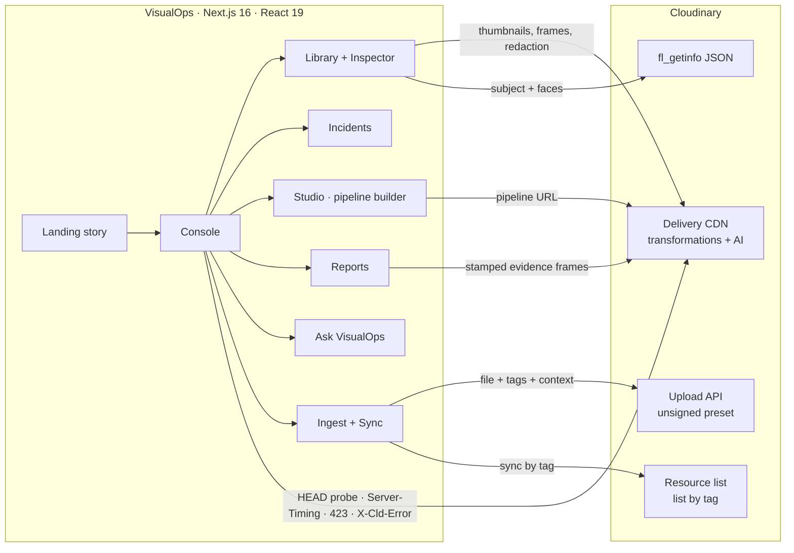

# VisualOps

**Turn visual data into operational intelligence.**

Hackathon team repository for Team rocket - [hackindia-team:pixels-to-products-cloudinary-ai-hackathon-2026:team-rocket]

VisualOps turns field photos, drone footage and CCTV into searchable, structured, actionable records. Every frame is delivered, understood and transformed by **Cloudinary**; VisualOps adds the operational layer on top — records, search, incident intelligence and evidence reports.

```
RAW MEDIA → CLOUDINARY → AI UNDERSTANDING → TRANSFORMATION → ORGANIZATION → SEARCH → INTELLIGENCE → ACTION
```

---

## Hackathon

**Pixels to Products — Cloudinary AI Hackathon 2026**
**Track 1 — AI Media Pipelines**

## Problem

Maintenance, construction, inspections, facilities, fleet and field teams produce huge amounts of visual media: phone photos sent to chat groups, drone passes, CCTV exports, intake photos. It arrives with a file name and nothing else — no site, no severity, no owner. It is scattered, hard to search, impossible to report on, and full of people who should not be identifiable when it is shared. The evidence exists; the intelligence does not.

## Solution

VisualOps is a web console that runs every capture through a Cloudinary media pipeline and turns it into an operational record:

| Stage | What happens | How |
| --- | --- | --- |
| **Raw media** | Photos and video are stored and delivered from Cloudinary; stills are extracted from footage | Upload API (unsigned preset), `so_` frame extraction |
| **Understand** | The subject and the people in each frame are detected; faces are redacted; soft captures are corrected | `g_auto`, `fl_getinfo`, `e_pixelate_faces`, `e_improve`, `e_sharpen` |
| **Structure** | Each asset becomes a record: site, zone, category, severity, status, observation, action | Cloudinary tags + contextual metadata, resource-list sync |
| **Search** | Plain-language questions become explicit, visible filters | Transparent query parser over the structured index |
| **Insight** | Risk by site, category × severity, capture activity | Aggregates computed from the records |
| **Action** | Evidence packages with stamped, redacted frames and a verifiable fingerprint | `l_text` audit stamp, `e_pixelate_faces`, SHA-256 of the export |

A guiding principle: **generative AI never touches the record.** Every pipeline step carries an integrity class — *Evidence-safe*, *AI edit* or *Generative* — shown on the step, the output and the export. Reports only ever use evidence-safe renditions.

## Cloudinary Integration

Everything below is live Cloudinary functionality — nothing is simulated. You can open any URL the app shows and it renders the same for anyone.

**Delivery and optimisation**
- Delivery URLs for every image and video, responsive renditions, `c_fill` / `c_limit` / `c_pad`, `q_auto`, `f_auto` (AVIF/WebP/JPEG per browser), `vc_auto` for video.
- **Measured, not claimed:** sizes, formats, cache status and processing time are read from Cloudinary's `Server-Timing` header (`content-info` exposes original vs delivered bytes). Errors come from `X-Cld-Error`.

**AI understanding**
- `g_auto` subject-aware cropping, and `fl_getinfo` to read Cloudinary's detected subject region and facial landmarks as JSON (shown as live overlays).
- `e_pixelate_faces` / `e_blur_faces` privacy redaction.

**Generative AI and AI edits (Visual AI Pipeline Builder + Generative Studio)**
- `e_background_removal`, `e_gen_background_replace` (prompt), `b_gen_fill` (generative fill / canvas extension), `e_gen_replace` (object replacement), `e_gen_recolor`, `e_gen_remove`, `e_gen_restore`, `e_upscale`, `e_enhance`, `e_improve`, `e_sharpen`.

**Video**
- Transcoding and resizing, trimming (`so_` / `du_`), frame extraction to JPEG, **AI highlights** (`e_preview:duration_N`) and **AI subject-tracking reframe** (`c_fill,ar_9:16,g_auto`). Cloudinary renders the last two asynchronously and answers HTTP 423 until they are ready — VisualOps polls and shows the real status.

**Annotation and export**
- `l_text` audit stamps (finding ID, severity, date) burned into report frames; `fl_attachment` downloads.

**Ingestion and sync (your own cloud)**
- Browser uploads through the Upload API with an **unsigned upload preset**, carrying `tags` and `context` metadata (site, category, severity, observation).
- **Sync from Cloudinary** reads everything carrying the VisualOps tag through the client-side resource list (`/<type>/list/<tag>.json`), including that context metadata.
- No API key or secret is used anywhere in the app.

**SDKs**
- `next-cloudinary` and the `cloudinary` Node SDK: the Studio exports each pipeline as next-cloudinary (React), the exact URL, the Node.js SDK, the Python SDK, cURL and pipeline JSON. `npm run verify:cloudinary` proves the React and Node exports reproduce the same transformations.

## Architecture



- **One source of truth for transformations.** Each pipeline step (`src/lib/cloudinary/pipeline.ts`) builds one Cloudinary transformation component. The Studio renders that URL, and the code exporter generates SDK code that `scripts/verify-cloudinary.mjs` runs through the real SDKs to confirm the output matches.
- **Live status, honestly shown.** Before displaying a render, VisualOps sends a `HEAD` request: `200` shows it with measured bytes and format, `423` means Cloudinary is still processing async AI and triggers polling, and anything else shows Cloudinary's own error message.
- **Client-only console.** The console reads the viewer's clock, URL hash (deep links such as `/console#studio/vo-road-collapse`) and `localStorage` (uploads and settings in this browser). The landing page is statically rendered.

## Features

- **Landing page** — a scroll-driven story through the six stages, an interactive raw-vs-Cloudinary inspection frame, live capability cards (hover any card to render the transformation) and a live measurement of what Cloudinary delivered for the page.
- **Overview** — open findings by severity, risk by site, capture activity, pipeline status and delivery savings measured live from Cloudinary.
- **Smart Media Library** — search and filter by type, category, severity, site and source; grid and list layouts; hover previews (Cloudinary-trimmed video clips); the card morphs into the inspector.
- **Inspector** — original, evidence (`e_improve` + `e_sharpen`) and face-redacted renditions; the sample annotation and Cloudinary's live `g_auto` and face regions as separate overlays; video playback with Cloudinary-extracted keyframes; measured delivery; copy URL, open original, download.
- **Visual Incident Intelligence** — filter by severity, category, location, date window, media type and status; a clickable category × severity matrix; findings worst-first.
- **Studio — Visual AI Pipeline Builder** — drag-to-reorder steps, toggle, configure, delete, and preview up to any step; 20 step types across framing, correction, privacy, annotation, AI edits, generative AI, video and delivery; 11 presets (evidence enhance, privacy redaction, audit stamp, low-res recovery, asset-register cutout, remediation preview, field clip, vertical brief, AI highlights, product studio, colourway).
- **Before / After viewer** — slider (with the original given the same framing so pixels line up), side by side and output-only; zoom from 1× to 4× with panning (buttons, keys, Ctrl/⌘ + wheel, double-click); fullscreen; keyboard-accessible handle. Video is compared side by side with "play both".
- **Generative Studio** — prompt-based background replacement with presets, plus object replace, recolour, remove and canvas fill. Outputs are always marked *Generative*.
- **Code / URL generator** — React (next-cloudinary), URL, Node.js SDK, Python SDK, cURL and pipeline JSON; copy and download.
- **Ask VisualOps (⌘K or /)** — plain-language questions such as *"Show high severity issues from Building B"* become visible filter chips; results show media, tags, the finding and why each matched; keywords with no match are reported, not silently dropped; "Report on these" turns a result set into a report.
- **Reports** — Inspection report, Incident summary, Media analysis report (measured delivery and AI signals) and Asset summary; scope by site, severity, status and date; Cloudinary-stamped, face-redacted evidence; export to Print/PDF, Markdown, JSON or CSV with a SHA-256 fingerprint computed in the browser.
- **Ingest and sync** — drag-and-drop uploads to your cloud with progress, and tag-based sync back from Cloudinary.
- **Accessible motion** — every animation respects `prefers-reduced-motion`; dialogs trap focus and close on Escape; controls are keyboard-operable.

## Setup

Requirements: **Node.js 20.9 or newer** (Next.js 16).

```bash
git clone https://github.com/iabhishekn/pixels-to-products-cloudinary-ai-hackathon-2026-team-rocket.git
cd pixels-to-products-cloudinary-ai-hackathon-2026-team-rocket
npm install
npm run dev
```

Open http://localhost:3000 for the story and http://localhost:3000/console for the app. No configuration is needed: the sample dataset renders from Cloudinary's public `demo` cloud.

Production build:

```bash
npm run build
npm run start
```

Checks:

```bash
npm run lint                 # ESLint
npm run typecheck            # TypeScript
npm run verify:cloudinary    # live Cloudinary checks (dataset, presets, code-export parity)
```

## Environment Variables

Copy `.env.example` to `.env.local` (never commit `.env.local`). All values are **public**; VisualOps never needs an API key or secret.

| Variable | Required | Purpose |
| --- | --- | --- |
| `NEXT_PUBLIC_CLOUDINARY_CLOUD_NAME` | For uploads/sync | Your Cloudinary cloud name. Defaults to `demo`. |
| `NEXT_PUBLIC_CLOUDINARY_UPLOAD_PRESET` | For uploads | An **unsigned** upload preset (Console → Settings → Upload → Upload presets). |
| `NEXT_PUBLIC_VISUALOPS_TAG` | No | Tag added to uploads and read by Sync. Defaults to `visualops`. |

The same values can be set at runtime in the console (cloud pill → *Cloudinary*); they are stored in that browser only. For **Sync**, your cloud must allow resource lists (Console → Settings → Security → uncheck *Resource list* under restricted media types).

## Demo

A recommended three-minute path:

1. **Landing** — move the pointer across the hero frame (raw drone frame vs Cloudinary evidence rendition) and note the live delivery measurement under the buttons. Scroll through the six-stage pipeline, then hover the "Built on Cloudinary" cards.
2. **Console → Overview** — open findings, risk by site, and the "Delivered by Cloudinary" figure measured from response headers.
3. **Ask VisualOps (⌘K)** — try *"Show high severity issues from Building B"*, then *"Show all damaged equipment"* (it says honestly that no record mentions "damaged").
4. **Library → IMG_4821.JPG** — toggle Evidence view, Faces redacted and the `g_auto` region. Open **DJI_0412.MOV** and click the keyframes.
5. **Studio** — on `IMG_2208.JPG` load *Privacy redaction* and drag the slider; on `WhatsApp Image 0412.jpeg` load *Remediation preview* and see the output marked *Generative*; on `DJI_0412.MOV` load *AI highlights* (Cloudinary may answer 423 first — watch it resolve). Open **Export code**.
6. **Incidents** — click a matrix cell, then *Report on these*.
7. **Reports** — switch templates, toggle face redaction, download Markdown/JSON and print to PDF; note the SHA-256.
8. **Ingest** — with your own cloud and unsigned preset, drop in a field photo and see it appear in the library; *Sync* reads it back from Cloudinary.

## Project Structure

```
src/
  app/
    page.tsx                  Landing page (server-rendered shell)
    console/page.tsx          Console route
    layout.tsx, globals.css   Fonts, metadata, design tokens, print & reduced-motion styles
  components/
    landing/                  Hero, pipeline story, Cloudinary capability cards, integrity, footer
    console/                  Shell, store (state + hash routing), views/, studio/, inspector, Ask palette, ingest, settings
    media/                    Probed renders, before/after viewer, video compare, frame strip, overlays, delivery receipt
    ui/                       Badges, segmented control, dialog/sheet, copy button
  lib/
    cloudinary/               url.ts (URL builder) · media.ts (renditions) · pipeline.ts (steps & presets)
                              codegen.ts (SDK export) · probe.ts (Server-Timing/423 probes) · insights.ts (fl_getinfo)
                              upload.ts (unsigned upload & sync) · config.ts
    data/dataset.ts           Sample dataset (15 field assets + 2 generic samples on Cloudinary's demo cloud)
    search/query.ts           Ask VisualOps parser and matcher
    analytics.ts, report.ts   Aggregates, report models, exports, SHA-256
scripts/verify-cloudinary.mjs Live verification against Cloudinary
```

## Data and honesty notes

- **Sample media** is real media hosted on Cloudinary's public `demo` cloud (object-detection docs imagery and demo videos), so every transformation is genuine and needs no account.
- **Sample findings** (site, category, severity, observation, action) are annotations written by the team for this dataset and describe only what is visible. The UI labels them *Sample annotation*. Cloudinary's AI signals (subject region, faces) are fetched live and shown separately.
- Sample capture times are relative to your clock, so "today" and "this week" stay meaningful. The CCTV clip keeps its burned-in timestamp.
- **Uploads and sync** use documented public Cloudinary endpoints. Sync was verified against the demo cloud (tag `truck`). Uploading requires your own unsigned preset and was not exercised against a real account while building this submission.
- Ask VisualOps is a transparent parser, not a language model. It shows its interpretation.

## Verification

`npm run verify:cloudinary` (no credentials needed) checks against the live Cloudinary CDN that:
- every sample asset's thumbnail, display rendition, original, playback stream and `fl_getinfo` response resolves;
- the Node SDK, given the exact transformation objects the Studio exports, and next-cloudinary's URL loader, given the exact React props, produce the same transformations as the rendered URL (all 20 step types and 11 presets);
- every preset renders, and report evidence frames render with stamp and redaction.

## Team

**Team Rocket** — HackIndia · Pixels to Products, Cloudinary AI Hackathon 2026.

| Member | Role |
| --- | --- |
| Abhishek Nayak | Repository owner |

## License

MIT — see [LICENSE](LICENSE).
