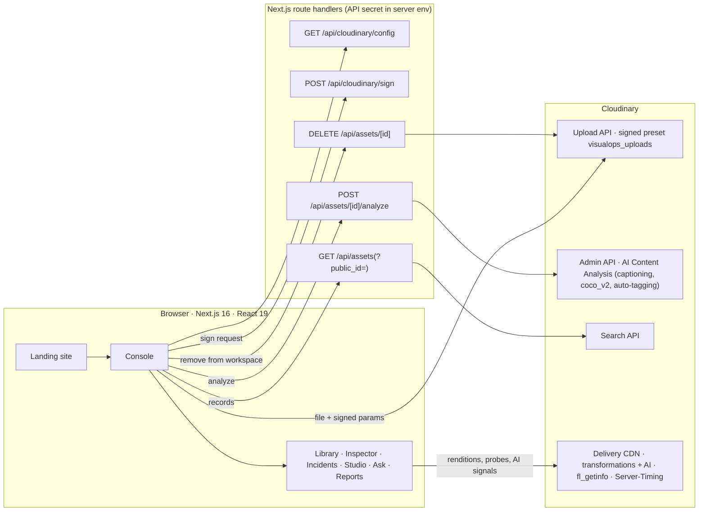

# VISUALOPS — AI-POWERED VISUAL INTELLIGENCE

**Turn visual data into operational intelligence.**

Hackathon team repository for Team rocket - [hackindia-team:pixels-to-products-cloudinary-ai-hackathon-2026:team-rocket]

VisualOps turns the photos, drone footage and CCTV clips that field teams already capture into searchable, structured, decision-ready evidence. Cloudinary stores, understands, transforms and delivers every frame. VisualOps adds the operational layer on top: records, incident intelligence, search and evidence reports.

```
FIELD MEDIA → CLOUDINARY INGESTION → CLOUDINARY AI UNDERSTANDING → STRUCTURED RECORD → SEARCH → INCIDENTS → EVIDENCE → REPORT
```

## Hackathon

**Pixels to Products — Cloudinary AI Hackathon 2026** (HackIndia) · **Track 1: AI Media Pipelines**

## Problem

Maintenance, construction, inspection, facilities and fleet teams produce huge amounts of visual media: phone photos sent to chat groups, drone passes, CCTV exports and intake photos. The media arrives with a file name and nothing else — no site, no severity and no owner. It is scattered and hard to search, you cannot report on it, and it is full of people who should not be identifiable when it is shared.

## Solution

VisualOps runs every capture through a Cloudinary media pipeline and turns it into an operational record. The record holds what a person classified and what Cloudinary's AI understood, and each part is labelled with where it came from.

| Stage | What happens | Cloudinary |
| --- | --- | --- |
| **Ingest** | Photos and video go straight from the browser to the team's cloud, with the record fields attached | Upload API with a **server-signed** upload preset; `tags` + contextual metadata |
| **Understand** | Cloudinary's AI captions the photo, detects objects with boxes and confidence, and auto-tags it. Faces and the subject-aware crop are read for photos and video frames | **AI Content Analysis** (`captioning`, `coco_v2` object detection, `auto_tagging`) through the Admin API; `fl_getinfo`, `g_auto` |
| **Classify** | A person's classification: site, zone, category, severity, status, observation and action | Contextual metadata on the asset |
| **Transform** | Evidence-safe renditions: exposure correction, face pixelation and a burned-in audit stamp | `e_improve`, `e_pixelate_faces`, `l_text`; async renders (HTTP 423) are polled |
| **Optimize** | Delivered bytes and format are measured against the original | `q_auto`, `f_auto`, `vc_auto`, `Server-Timing` |
| **Index** | The record is searchable by its human fields **and** its AI caption, objects and tags | **Search API** read-back (`GET /api/assets`) |

On top of the records: **Ask VisualOps** (search), **Incident Intelligence** and **Reports** (evidence packages with a SHA-256 fingerprint).

A guiding principle: **generative AI never touches the record.** Every pipeline step carries an integrity class — *Evidence-safe*, *AI edit* or *Generative* — and that class is shown on the step, the output and the export. Reports only use evidence-safe renditions.

## Provenance model

Every fact VisualOps shows is labelled with a provenance badge (`src/components/ui/Provenance.tsx`) wherever a finding, tag or value is presented. The report exports (JSON, CSV and Markdown) carry the same labels.

| Badge | Meaning | Examples |
| --- | --- | --- |
| **AI detected** | Returned by Cloudinary's AI | Caption, detected objects (boxes + confidence), auto-tags, face detections, `g_auto` crop |
| **Human classified** | Written by a person: entered at ingest, or a team-written *sample annotation* | Title, site, zone, category, severity, status, observation, action, marked region |
| **System derived** | Computed or measured by VisualOps | Counts, rankings, ages, delivery bytes/format/cache, HTTP status of a probed frame |

The AI understanding never overwrites the human classification. The two are stored side by side on the asset, shown side by side in the Inspector (AI boxes and the human-marked region), and exported side by side.

## Key features

- **Landing site** — the product story. It has:
  - a raw-vs-Cloudinary inspection frame with live delivery telemetry;
  - a WebGL field built from a texture atlas that Cloudinary composites in one request;
  - a six-stage scroll story, and a product preview that morphs into the console;
  - a live Cloudinary capability explorer.
- **AI understanding on ingest** — when a photo is uploaded, the server runs Cloudinary AI Content Analysis on it:
  - **captioning** — a one-sentence description of the frame;
  - **coco_v2 object detection** — each object's label, confidence and bounding box;
  - **auto-tagging** at 0.5 confidence — the detected objects become Cloudinary tags.

  The results are written into the asset's contextual metadata (`ai_caption`, `ai_objects`, `ai_tags`, `ai_model`, `analyzed_at`), next to the record keys, which are kept. Every device reads the understanding back from Cloudinary. Videos are not analysed; they keep face and crop signals from `fl_getinfo` on the poster frame.
- **Real cloud workspace** — with the server configured, the console shows **only** the team's records from Cloudinary (the *cloud* workspace), seeded by `npm run seed:cloudinary`; bundled samples are hidden. Without a configured server, or while the cloud holds no VisualOps record yet, it shows the bundled *sample* workspace on Cloudinary's public `demo` cloud.
- **Command Center** — the worst open finding first, then:
  - key numbers and capture activity;
  - inspection progress by site;
  - delivery latency and CDN hit ratio, measured from Cloudinary's `Server-Timing` headers;
  - a live stream of the session's Cloudinary responses.
- **Media Library + Inspector** — an editorial mosaic with filters and Cloudinary-trimmed video previews. The Inspector shows:
  - the **AI boxes** Cloudinary detected, next to the **human-marked region**;
  - the caption and auto-tags, labelled *AI detected*;
  - original, evidence-enhanced and face-redacted renditions;
  - face detections, video keyframes and a delivery receipt.

  From the Inspector you can remove a record from the workspace. This only takes off the VisualOps tag; the media stays in Cloudinary.
- **Incident Intelligence** — a lead finding, findings grouped by severity, and a clickable category × severity risk matrix. Filters: status, severity, category, site, date and media type.
- **Studio — Visual AI Pipeline Builder** — transformation steps and presets for operations work. It has:
  - a before/after viewer (slider, side-by-side, zoom);
  - code export for React (next-cloudinary), URL, Node, Python, cURL and JSON.

  Generative steps (background replace, object replace, recolour, remove, fill) stay available for previews, but they are clearly marked *Generative* and are never used as evidence.
- **Pipeline machine** — runs *Ingest → Understand → Classify → Transform → Optimize → Index* against Cloudinary for one capture. Each stage shows its real latency and result, and nothing is simulated.
- **Ask VisualOps** (Ctrl/⌘ K or `/`) — plain-language questions such as *"sinkhole"*, *"trucks"* or *"Show high severity issues from Building B"*:
  - Matches use the human classification **and** the Cloudinary AI caption, objects and tags, and results carry provenance badges.
  - Each search runs in visible stages, with its interpretation shown as chips. Unmatched words are reported, not dropped.
- **Reports** — four templates: inspection, incident summary, media analysis and asset summary.
  - Generation runs in real stages, and every evidence frame is requested from Cloudinary during the run.
  - The document shows provenance badges (human / AI / system), the AI understanding per record, and per-frame delivery results and face-detection counts.
  - Export to Print/PDF, Markdown, JSON or CSV, with a SHA-256 fingerprint of the JSON export (see [Reports and the SHA-256](#reports-and-the-sha-256)).
- **Accessible, smooth motion** — every animation respects `prefers-reduced-motion`. Scroll scenes write transforms directly; WebGL and animation loops run only while visible. Dialogs trap focus, and all controls work from the keyboard.

### Removed

We removed playground features that did not serve the operations workflow, including the Studio's *Colourway* and *Product studio* presets. The product stays focused on evidence: ingest, understand, classify, search, incidents and reports.

## How VisualOps works

1. **Ingest.** In the console, *Ingest* asks the VisualOps server to sign an upload (`POST /api/cloudinary/sign`). The server:
   - validates the record fields;
   - pins the VisualOps tag and the signed preset `visualops_uploads`;
   - signs the exact parameters with the API secret.

   The browser then uploads the file **directly to Cloudinary**; the file bytes never pass through the VisualOps server.
2. **Understand.** For photos, the browser calls `POST /api/assets/[id]/analyze`. The server checks that the asset carries the VisualOps tag, then runs Cloudinary AI Content Analysis through the Admin API (`update` with `detection: 'captioning'`, then `detection: 'coco_v2'` + `auto_tagging: 0.5`). It parses the result into `{ caption, objects[{label, confidence, box}], tags, model, analyzedAt }` and **merges** it into the asset's contextual metadata. The route reads the existing context first, so no record key is lost. An asset that was already analysed returns its stored result without spending detections.
3. **Store.** Cloudinary holds the media plus the whole record:
   - tags: `visualops`, category, site, and the auto-tags;
   - contextual metadata: the human fields, provenance (`sample-annotation` or `ingest`), capture-time basis and the AI keys.

   The key contract is in `src/lib/cloudinary/record-context.ts`. There is no database.
4. **Read back.** The server queries Cloudinary's **Search API** (`GET /api/assets`, `tags=visualops`, with context and tags) and returns every record. `GET /api/assets?public_id=…` fetches one record by exact public ID. The library, incidents, search and reports all work from these records.
5. **Transform and act.** Every view renders Cloudinary delivery URLs with transformations applied on request. `fl_getinfo` returns face landmarks and the `g_auto` crop as JSON. `HEAD` requests read `Server-Timing` for measured bytes, format, cache status and timing. Reports assemble stamped, redacted evidence frames and export a fingerprinted package.

## Reports and the SHA-256

The report's SHA-256 is computed in the browser (Web Crypto) over **the exported JSON: records + evidence URLs + delivery results** (schema `visualops.report/v3`). For every finding, the hashed JSON holds:

- the **human-classified fields** and who wrote them (`sample-annotation`, `ingest` or `synced`);
- the **Cloudinary AI understanding**, when present: caption, objects with confidence and boxes, auto-tags, model and analysis time (`provenance: "ai"`);
- the **evidence frame URL exactly as rendered** in the document, and its **delivery result from the run**: HTTP status, bytes, format, dimensions and cache;
- Cloudinary's **face-detection count** for that frame, and the **capture-time basis** (a sample time, or a time recorded by Cloudinary or burned into the footage).

The JSON download is exactly the hashed bytes, so you can recompute the digest with `sha256sum visualops-<kind>-<date>.json` (or `shasum -a 256` on macOS). The image bytes themselves are not hashed; each frame is identified by its URL and its measured size. The Markdown and CSV exports are renderings of the same payload. The Markdown escapes all record and Cloudinary text (Markdown/HTML special characters, table pipes, bare links), and the CSV guards against spreadsheet formula injection.

The landing page's SHA-256 values are labelled **sample report payload**. They are computed over a fixed sample payload that names exactly the evidence frame URL shown next to them.

## Cloudinary integration

Everything below is live Cloudinary functionality; nothing is simulated.

| Capability | How VisualOps uses it | Where |
| --- | --- | --- |
| **Upload API (signed)** | Server signs with `api_sign_request`, using the signed preset `visualops_uploads` | `src/app/api/cloudinary/sign/route.ts`, `src/lib/cloudinary/upload.ts` |
| **AI Content Analysis** | Captioning + `coco_v2` object detection with auto-tagging, run synchronously through the Admin API `update`. Results are merged into the asset's context | `src/app/api/assets/[id]/analyze/route.ts`, `src/lib/cloudinary/ai.ts` |
| **Tags + contextual metadata** | The record, provenance and AI understanding travel with the asset | `src/lib/cloudinary/record-context.ts`, `src/lib/cloudinary/ingest-fields.ts` |
| **Structured metadata** | Set up once in the team's cloud by `npm run setup:cloudinary` | `scripts/` |
| **Search API** | Reads back every VisualOps record (`tags=visualops`, with context and tags), or one by `public_id` | `src/app/api/assets/route.ts` |
| **Upload API `remove_tag`** | Takes a record out of the workspace without deleting the media | `src/app/api/assets/[id]/route.ts` |
| **Transformations** | `c_fill`/`c_limit`, `g_auto`, `so_`/`du_` video, `l_text` stamps, overlay atlas (`l_` + `fl_layer_apply`) | `src/lib/cloudinary/{url,media,pipeline,atlas}.ts` |
| **Delivery-time AI** | `g_auto`, `fl_getinfo` face and crop signals, `e_pixelate_faces`, `e_improve`, `e_background_removal`, `e_upscale`, `e_enhance`, `e_gen_*`, `b_gen_fill`, `e_preview` (video highlights) | `src/lib/cloudinary/{pipeline,insights}.ts` |
| **Optimisation** | `q_auto`, `f_auto`, `vc_auto`, measured from `Server-Timing`; async renders (HTTP 423) are polled | `src/lib/cloudinary/probe.ts` |
| **SDKs** | The `cloudinary` Node SDK on the server; `next-cloudinary` and Node/Python snippets in the code export (parity checked by `npm run verify:cloudinary`) | `src/lib/server/cloudinary.ts`, `src/lib/cloudinary/codegen.ts` |

**AI Content Analysis quota.** The free plan includes **500 detections a month**. Each analysis spends two (captioning + `coco_v2`), and only images are analysed. The analyze route returns a stored result instead of re-running an analysis, and it is rate-limited per IP (20 analyses per 10 minutes).

## API routes

All routes are Next.js route handlers (`src/app/api/**/route.ts`). The API secret is read only on the server, and responses never include it.

| Route | Purpose | Guards |
| --- | --- | --- |
| `GET /api/cloudinary/config` | Which cloud the server is connected to (public values only) | — |
| `POST /api/cloudinary/sign` | Signs an upload for the preset `visualops_uploads` | Same-origin, allow-listed fields and values, body size limit, rate limit |
| `GET /api/assets` | Every VisualOps record from the Search API | Rate limit |
| `GET /api/assets?public_id=<id>` | One record by exact public ID (it must carry the VisualOps tag) | Strict public-ID validation |
| `POST /api/assets/[id]/analyze` | Cloudinary AI understanding of one VisualOps image (`{ resourceType: 'image' }`), merged into its context. Returns `{ ai, tags }` | Same-origin, VisualOps tag required, images only, 20 per 10 min per IP; errors 400/403/404/429/502/503 without secrets |
| `DELETE /api/assets/[id]?resourceType=image\|video` | Removes **only** the VisualOps tag, so the record leaves the workspace but the media stays in Cloudinary | Same-origin, VisualOps tag required, rate limit |

## Architecture



- **The secret stays on the server.** Only `src/lib/server/cloudinary.ts` (`import 'server-only'`) reads `CLOUDINARY_API_SECRET`, and only the route handlers import it.
- **Server routes are guarded.** They are same-origin only and allow-list their inputs. They act only on assets carrying the VisualOps tag, apply a best-effort rate limit, and map Cloudinary errors to safe messages.
- **Security headers** (`next.config.ts`) apply to every response:
  - `Content-Security-Policy`:
    - `default-src 'self'`;
    - images and media from `self`, `data:`/`blob:` and `https://res.cloudinary.com`;
    - `connect-src` to `self`, `res.cloudinary.com` and `api.cloudinary.com`;
    - `script-src 'self' 'unsafe-inline'` (Next's inline runtime; `'unsafe-eval'` only in development);
    - `frame-ancestors 'none'`, `base-uri 'self'`, `form-action 'self'`, `object-src 'none'`.
  - `X-Frame-Options: DENY`
  - `X-Content-Type-Options: nosniff`
  - `Referrer-Policy: strict-origin-when-cross-origin`
  - `Permissions-Policy: camera=(), microphone=(), geolocation=()`
  - HSTS in production.
- **Everything else is static.** Pages are prerendered. The browser talks to Cloudinary's CDN directly for media, probes and `fl_getinfo`.
- **No database.** Cloudinary is the system of record (asset + tags + context). The browser's local storage keeps only UI preferences and a cache of records added in this browser.

## Technology stack

| Area | Technology |
| --- | --- |
| Framework | Next.js 16 (App Router, route handlers, Turbopack), React 19, TypeScript |
| Styling and motion | Tailwind CSS v4, framer-motion, WebGL2 (landing field) |
| Media and AI | Cloudinary Upload, Admin (AI Content Analysis), Search and Delivery APIs; `cloudinary` Node SDK; `next-cloudinary` (code export) |
| Tooling | ESLint, `tsc`, Cloudinary setup / seed / verification scripts |

## Project structure

```
src/
  app/
    page.tsx                     Landing page
    console/page.tsx             Console
    privacy/, terms/             Legal pages
    api/cloudinary/config/       GET    — which cloud the server is connected to (public values)
    api/cloudinary/sign/         POST   — signs an upload (API secret on the server)
    api/assets/                  GET    — records from Cloudinary's Search API (?public_id= for one)
    api/assets/[id]/             DELETE — removes the VisualOps tag (media stays in Cloudinary)
    api/assets/[id]/analyze/     POST   — Cloudinary AI Content Analysis → asset context
  components/
    landing/                     Hero (+ WebGL field), scroll story, solutions, product preview, evidence, technology, CTA
    console/                     Shell, store, views, overview, library, incidents, studio (+ pipeline machine), ask, reports, ingest
    media/                       Probed renders, before/after viewer, video compare, overlays, delivery receipt
    site/, motion/, ui/          Navigation, footer, cursor; motion primitives; shared UI (incl. provenance badges)
  lib/
    server/cloudinary.ts         Server-only Cloudinary config, guards, error mapping
    cloudinary/                  URL builder, renditions, pipeline steps & presets, code export, probes, fl_getinfo insights,
                                 AI understanding (ai.ts), record context contract, atlas, upload/sync, backend client
    data/dataset.ts              Bundled sample dataset (Cloudinary demo cloud)
    search/query.ts              Ask VisualOps parser and matcher
    analytics.ts, report.ts      Aggregates, report model, exports (JSON/CSV/Markdown), SHA-256
scripts/                         Cloudinary setup, sample-workspace seed and live verification
```

## Setup

Requirements: **Node.js 20.9 or newer**, and a Cloudinary account with the **AI Content Analysis** add-on enabled (its free tier is enough).

```bash
git clone https://github.com/HackIndiaXYZ/pixels-to-products-cloudinary-ai-hackathon-2026-team-rocket.git
cd pixels-to-products-cloudinary-ai-hackathon-2026-team-rocket
npm install
```

Then, in this order:

1. **Environment** — `cp .env.example .env.local` and fill in your Cloudinary values (see below). Never commit `.env.local`.
2. **Cloud setup** — `npm run setup:cloudinary` creates the structured metadata VisualOps uses in your cloud.
3. **Seed the workspace** — `npm run seed:cloudinary` uploads the sample field captures to your cloud, tagged `visualops`. Their team-written annotations are stored with `provenance=sample-annotation`, so the console labels them *Human classified · sample annotation*.
4. **Run** — `npm run dev`.

Without `.env.local` the app still runs, read-only, on the bundled sample workspace on Cloudinary's public `demo` cloud.

### Cloudinary account

1. **Credentials:** Console → **Settings → API Keys** gives the cloud name, API key and API secret.
2. **Upload preset:** Settings → **Upload → Upload presets** → create **`visualops_uploads`** with these settings:
   - signing mode **Signed**;
   - type *upload*;
   - overwrite on;
   - use filename off;
   - unique filename off;
   - use filename as display name on.
3. **AI Content Analysis:** enable the add-on (Console → Add-ons). The free plan includes 500 detections a month.
4. **No Resource list needed:** leave the "Resource list" delivery type restricted. VisualOps reads records through the Search API on the server.
5. **Protect your credits (after deploying):**
   - Settings → **Security** → enable **Strict transformations**.
   - Add your deployed domain, and `localhost` for development, under **Allowed strict referral domains**.
   - Only pages served from your own site can then create new derived images, including generative edits and upscales; hot-linked or scripted requests from elsewhere are refused.
   - Renditions already created keep working, and the server-side Upload, Admin and Search API calls are unaffected.

## Environment variables

Copy `.env.example` to `.env.local`. **Never commit `.env.local`**: every `.env*` file except `.env.example` is git-ignored.

| Variable | Where | Required | Purpose |
| --- | --- | --- | --- |
| `CLOUDINARY_CLOUD_NAME` | server | for uploads and records | Your cloud name |
| `CLOUDINARY_API_KEY` | server | for uploads and records | API key (returned to the browser only alongside a signature) |
| `CLOUDINARY_API_SECRET` | server | for uploads and records | **Secret.** Signs uploads and authenticates the Admin and Search API calls. Never exposed |
| `CLOUDINARY_UPLOAD_PRESET` | server | recommended | Signed upload preset, `visualops_uploads` |
| `VISUALOPS_TAG` | server | no | Tag that marks VisualOps records (default `visualops`) |
| `NEXT_PUBLIC_CLOUDINARY_CLOUD_NAME`, `NEXT_PUBLIC_CLOUDINARY_UPLOAD_PRESET`, `NEXT_PUBLIC_VISUALOPS_TAG` | browser | no | Fallback for deployments without server credentials: unsigned preset and client-side resource list. Public values only |

## Running locally

```bash
npm run dev          # http://localhost:3000 (site) · http://localhost:3000/console (app)
```

Checks:

```bash
npm run lint                 # ESLint
npm run typecheck            # Next.js route types + TypeScript
npm run verify:cloudinary    # live Cloudinary checks: dataset, presets, code-export parity
```

## Build and deployment

```bash
npm run build
npm run start
```

VisualOps deploys to any Node host that runs Next.js, such as Vercel. Set the server environment variables in the host's settings, not in the repository. Pages are static; the `/api` routes run on demand.

## Data and honesty notes

- **Three kinds of facts, always labelled.** *AI detected* (Cloudinary), *Human classified* (ingest, or team-written sample annotation) and *System derived* (computed or measured). The UI and every export keep them apart.
- **Sample annotations.** The findings of the sample workspace — both the bundled dataset and the seeded cloud workspace — are written by the team and labelled *sample annotation*. Their capture times are relative to your clock, and audit stamps on bundled samples show `SAMPLE` instead of a date.
- **Cloudinary's AI can be wrong.** Captions, object labels and face detections are machine output with confidence scores, and they are never merged into the human classification. Face detection can miss people, so check a frame before sharing it.
- **Records you ingest** carry the fields you enter. Their capture time is Cloudinary's upload time.
- **Delivery savings** include resizing to display size as well as `q_auto`/`f_auto`, and they are labelled that way.
- **Ask VisualOps** is a transparent parser, not a language model. It shows its interpretation.
- **Removing a record** takes off the VisualOps tag only; it never deletes media.

## Team

<div align="center">

### 🚀 Team Rocket

**Pixels to Products — Cloudinary AI Hackathon 2026** · Track 1: AI Media Pipelines

<br/>

<table>
  <tr>
    <td align="center" valign="top" width="25%">
      <br/>
      
      <h3>Abhishek Nayak</h3>
      <sub><b>🎨 Product &amp; Frontend</b></sub>
      <br/><br/>
      <a href="mailto:iabhishekn@gmail.com"></a>
      <a href="https://github.com/iabhishekn"></a>
      <br/><br/>
    </td>
    <td align="center" valign="top" width="25%">
      <br/>
      
      <h3>Aditya Raikwar</h3>
      <sub><b>🧠 AI &amp; Media Intelligence</b></sub>
      <br/><br/>
      <a href="mailto:adityaraikwar792@gmail.com"></a>
      <a href="https://github.com/adityaraikwar792-lab"></a>
      <br/><br/>
    </td>
    <td align="center" valign="top" width="25%">
      <br/>
      
      <h3>Akshat Lohiya</h3>
      <sub><b>☁️ Backend &amp; Cloudinary Integration</b></sub>
      <br/><br/>
      <a href="mailto:akshatlohiya12@gmail.com"></a>
      <a href="https://github.com/akshatlohiya12-mac"></a>
      <br/><br/>
    </td>
    <td align="center" valign="top" width="25%">
      <br/>
      
      <h3>Nethaniel Johan Kurian</h3>
      <sub><b>🔗 Full-Stack Integration &amp; Technical Lead</b></sub>
      <br/><br/>
      <a href="mailto:nethk1006@gmail.com"></a>
      <a href="https://github.com/Neth766"></a>
      <br/><br/>
    </td>
  </tr>
</table>

<sub>Roles describe each member's area of responsibility for the hackathon; they are not a record of individual commits.</sub>

</div>

## License

MIT — see [LICENSE](LICENSE).
